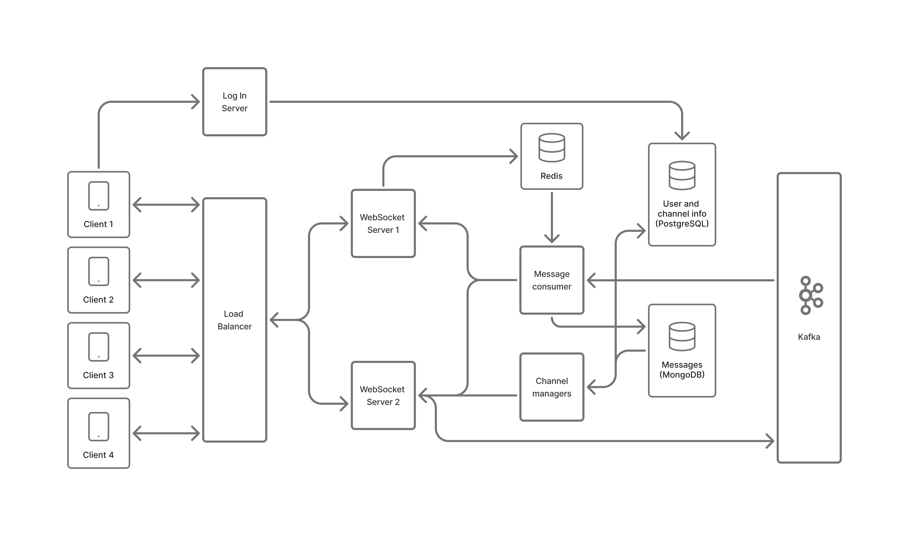

# ScaleChat

## A scalable, event-driven chat platform built with Apache Kafka and microservices

A modern chat application demonstrating distributed systems architecture using Apache Kafka, FastAPI, WebSockets, and a multi-database backend (PostgreSQL, MongoDB, Redis). All client communication — messages and channel operations — flows through a single persistent WebSocket connection.

<details>
<summary>Table of Contents</summary>

- [Key Features](#key-features)
- [Architecture](#architecture)
  - [Services Overview](#services-overview)
  - [Message Flow](#message-flow)
  - [Channel Operations Flow](#channel-operations-flow)
  - [WebSocket Protocol](#websocket-protocol)
- [Technology Stack](#technology-stack)
- [Installation](#installation)
- [Project Structure](#project-structure)
- [Development Progress](#development-progress)
- [Future Enhancements](#future-enhancements)
- [Learning Resources](#learning-resources)
- [Project Background](#project-background)

</details>



## Key Features

- **Single WebSocket connection** for all client interactions — messages and channel operations share one persistent connection
- **Typed request protocol** over WebSocket: type `0` for messages, type `1` for channel operations
- **Event-driven message distribution** via Apache Kafka with partition-per-channel guarantees
- **Horizontal scaling** — multiple WebSocket server instances behind an Nginx load balancer
- **Real-time presence tracking** — member online status via Redis
- **Multi-database architecture**:
  - PostgreSQL for users, channels, and membership
  - MongoDB for persistent message history
  - Redis for active connection tracking (username → server mapping)
- **RSA-based JWT authentication** (RS256) with BCrypt password hashing
- **Full channel lifecycle**: create, search, join, leave, view members, view history
- **Web client** with login, registration, channel dashboard, and chat UI

## Architecture

### Services Overview

| Service | Port | Responsibility |
|---|---|---|
| `nginx_load_balancer` | 5001 | WebSocket load balancing across server instances |
| `websocket_server_1/2` | 5010/5011 | WebSocket connections, Kafka producer, request routing |
| `login_server` | 5002 | Authentication, user registration, JWT issuance |
| `message_consumer` | 5003 | Kafka consumer, message distribution, MongoDB storage |
| `channel_manager` | 5005 | Channel CRUD, membership, message history |
| `web_client` | 5004 | Browser UI (Jinja2 + HTML/CSS/JS) |
| `relational_database` | 5432 | PostgreSQL — users, channels, memberships |
| `redis` | 6379 | Active connection map (no persistence) |
| `mongodb` | 27017 | Message history storage |

### Message Flow

When a client sends a chat message:

1. **Client → WebSocket Server**: client sends a `type: 0` request with the message payload over the open WebSocket connection.
2. **WebSocket Server → Kafka**: server publishes the message to the `messages` topic, keyed by `channel_id` to ensure all messages from the same channel land in the same partition.
3. **Kafka → Message Consumer**: one consumer instance in the `websocket-message-producer` consumer group polls the topic.
4. **Message Consumer processing**:
   - Queries PostgreSQL for all members of the channel.
   - Looks up each member's active WebSocket server in Redis.
   - POSTs the message to the correct WebSocket server instance for each online recipient (skipping the sender).
   - Persists the message to MongoDB.
5. **WebSocket Server → Client**: delivers the message to the recipient's open WebSocket connection.

### Channel Operations Flow

All channel operations (except login) are routed through the WebSocket connection rather than separate HTTP calls. This avoids opening new connections for each action.

When a client sends a `type: 1` request, the WebSocket server proxies it to the **Channel Manager** via internal async HTTP and returns the response over the same WebSocket:

| Operation Code | Action |
|---|---|
| `0` | Join a channel |
| `1` | Create a channel |
| `2` | List user's channels |
| `3` | Search channels by name |
| `4` | Fetch channel message history |
| `5` | Get channel members with online status |
| `6` | Leave a channel |

### WebSocket Protocol

**Client → Server request envelope:**
```json
{
  "type": 0,
  "data": "{\"message_id\": \"...\", \"channel_id\": 1, \"timestamp\": \"...\", \"username\": \"...\", \"message\": \"...\"}"
}
```

- `type: 0` — chat message (forwarded to Kafka)
- `type: 1` — channel operation (forwarded to Channel Manager)

**Server → Client message delivery:**
```json
{
  "message_id": "...",
  "channel_id": 1,
  "timestamp": "...",
  "username": "...",
  "message": "..."
}
```

**Server → Client acknowledgment (on send):**
```json
{"status": "sent", "message_id": "..."}
```

## Technology Stack

- **Backend**: FastAPI (Python) — all services
- **Message Broker**: Apache Kafka (`confluent-kafka`)
- **Databases**:
  - PostgreSQL 16 (users, channels, memberships via SQLModel)
  - MongoDB (message history via PyMongo)
  - Redis (ephemeral active connection state)
- **Frontend**: Jinja2 templates, HTML/CSS/JS, Bootstrap
- **Auth**: OAuth2 password flow, JWT (RS256 with RSA key pair), BCrypt
- **Load Balancer**: Nginx (round-robin WebSocket proxy)
- **Containerization**: Docker & Docker Compose

## Installation

### Prerequisites

- [Docker](https://www.docker.com/get-started) and Docker Compose

### 1. Start Kafka Infrastructure

```bash
cd fastapi_kafka
docker-compose -f compose.kafka.yaml up -d
```

### 2. Create Kafka Topic

```bash
docker exec -it kafka-cluster-kafka-1-1 /bin/sh

/bin/kafka-topics --bootstrap-server kafka-1:9092 \
  --create --topic messages --partitions 20 --replication-factor 1

/bin/kafka-topics --bootstrap-server kafka-1:9092 --list
```

### 3. Start Application Services

```bash
docker-compose up -d
```

### 4. Access the Web Client

Open `http://localhost:5004`

Default seed users (password: `secret`): `olivia.rodrigo`, `taylor.swift`, `gracie.abrams`

## Project Structure

```
fastapi_kafka/
├── login_server/          # Auth service — registration, JWT issuance
├── websocket_server/      # WebSocket hub — Kafka producer, request routing
├── message_consumer/      # Kafka consumer — message distribution and storage
├── channel_manager/       # Channel CRUD, membership, history
├── web_client/            # Browser UI (Jinja2 templates)
├── databases/
│   ├── mongodb/           # MongoDB init scripts
│   └── relational_database/ # PostgreSQL schema and seed data
├── nginx/                 # Load balancer config
├── auxiliar/              # RSA key generation scripts and key files
├── compose.yaml           # Application services
└── compose.kafka.yaml     # Kafka cluster
```